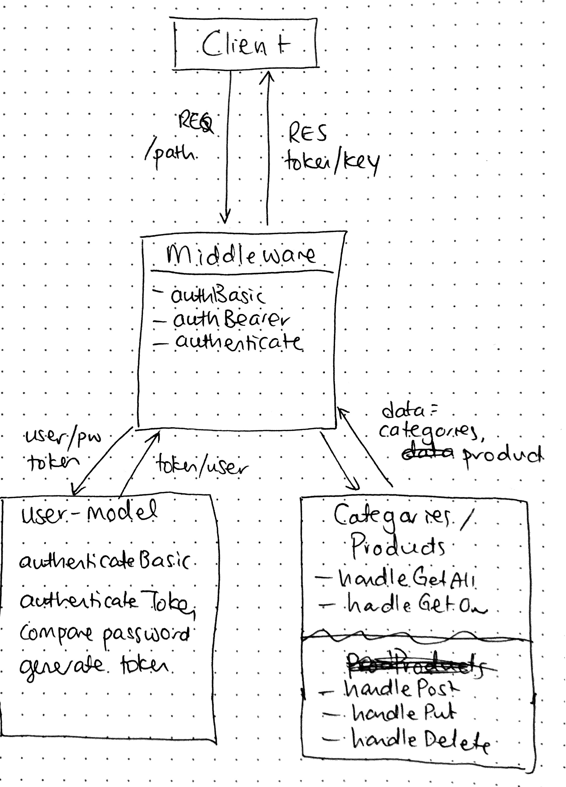

# LAB - 15

## Build API Server

### Author: Joanna Arroyo

### Links and Resources
* [submission PR](https://github.com/joanna-401-advanced-javascript/lab-15-api-server/pull/1)
* [travis](https://travis-ci.com/joanna-401-advanced-javascript/lab-15-api-server)
* [front-end](https://joanna-lab-15.herokuapp.com/) (when applicable)

#### Documentation
* [jsdoc](https://joanna-lab-15.herokuapp.com/docs) (Server assignments)

### Modules
#### `v1.js`
#### `app.js`
#### `router.js`
#### `middleware.js`
#### `users-model.js`
#### `404.js`
#### `error.js`

##### Exported Values and Methods

###### `handleGetAll() -> object`
Gets all existing records
###### `handleGetOne(id) -> object`
Gets one existing record by id
###### `handlePost() -> object`
Creates new record
###### `handlePut(id) -> object`
Updates existing record
###### `handleDelete(id) -> object`
Deletes existing record
###### `_authBasic(authString) -> object`
Authenticates the request header if basic authentication
###### `_authBearer(authString) -> object`
Authenticates the request header if bearer authentication
###### `_authentication(user) -> object`
Generates user token 

### Setup
#### `.env` requirements
* `PORT` - Port Number
* `MONGODB_URI` - URL to the running mongo instance/db
* `SECRET` - Secret for authentication

#### Running the app
* `npm start`
* Endpoint: `/signup`
  * Returns a jwt token generated from the log in information.
* Endpoint: `/signin`
  * Returns a token for all future requests.
* Endpoint: `/key`
  * Returns a token for all future requests that will not expire.
* Endpoint: `/oauth`
  * Returns a JSON object with xyz in it.
* Endpoint: `/posts`
  * Returns a JSON object with xyz in it.
* Endpoint: `/api/v1/categories`
  * Returns all existing categories
* Endpoint: `/api/v1/products`
  * Returns all existing products

#### Tests
* Unit test: `npm run test`
* Lint test: `npm run lint`

#### UML
